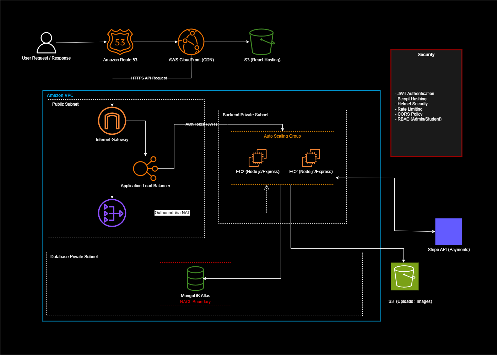
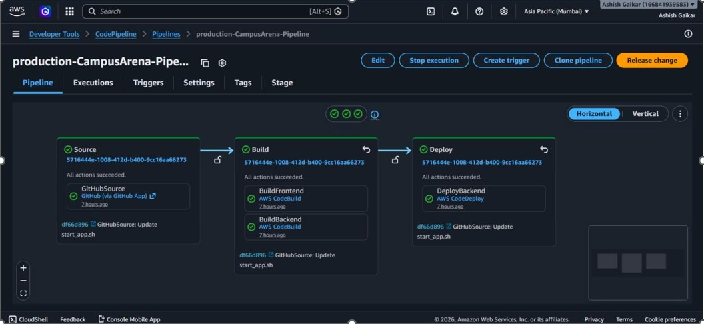

# CampusArena — AWS Infrastructure & CI/CD Pipeline

Production-grade AWS infrastructure and CI/CD automation built for **CampusArena**, a full-stack Campus Event Management System (React + Node.js/Express + MongoDB Atlas).

> This repository documents the **AWS infrastructure and CI/CD pipeline**, which I designed and implemented as part of a 5-member team project. The full application source code (frontend/backend) lives in the team repository: [CampusArenaProject](https://github.com/YashSabale01/CampusArenaProject).

## Overview

CampusArena is deployed on a secure, scalable multi-tier AWS architecture with a fully automated CI/CD pipeline — from a GitHub push to a live, zero-downtime production deployment.

## Architecture



**Traffic flow:** Route 53 → CloudFront (CDN) → S3 (React frontend) / ALB → Auto Scaling EC2 (Node.js/Express backend) → MongoDB Atlas

| Layer | Components |
|---|---|
| **Networking** | Custom VPC across 2 Availability Zones, public + private subnets, Internet Gateway, NAT |
| **Frontend** | React app hosted on S3, served via CloudFront CDN |
| **Backend** | Node.js/Express on EC2, behind an Application Load Balancer, in an Auto Scaling Group (private subnet) |
| **Database** | MongoDB Atlas, isolated in a database subnet with NACL boundary |
| **Integrations** | Stripe API (payments), S3 (image uploads) |
| **Security** | JWT authentication, bcrypt password hashing, Helmet, rate limiting, CORS policy, RBAC (Admin/Student) |

## CI/CD Pipeline



Fully automated deployment pipeline, triggered on every push to `main`:

```
GitHub push → CodePipeline → CodeBuild (frontend + backend, in parallel) → CodeDeploy (rolling deploy to ASG)
```

- **Frontend build:** React build → sync to S3 → CloudFront cache invalidation
- **Backend build:** npm install → bundle → deployment artifact
- **Deploy:** CodeDeploy rolling ("one at a time") deployment to the EC2 Auto Scaling Group, with **automatic rollback** on deployment failure or CloudWatch alarm

## Infrastructure as Code

All infrastructure is defined in a single, modular AWS CloudFormation template (52 resources), covering:

- **Networking** — VPC, public/private subnets (x2 AZs), route tables, NACLs, Internet Gateway
- **Compute** — Launch Template, Auto Scaling Group, Application Load Balancer + Target Group
- **CI/CD** — CodePipeline (V2), CodeBuild projects (frontend + backend), CodeDeploy application & deployment group
- **Storage** — S3 buckets (frontend hosting, uploads, pipeline artifacts)
- **Delivery** — CloudFront distribution with Origin Access Control
- **Secrets** — SSM Parameter Store (JWT secret, MongoDB URI, Stripe keys — all `NoEcho`)
- **Monitoring** — CloudWatch alarms (ALB 5xx errors, EC2 high CPU, pipeline failures)

## Security

- No hardcoded credentials — secrets managed via **AWS Systems Manager Parameter Store**
- Backend and database resources isolated in **private subnets**, not directly internet-facing
- Network access controlled via **Security Groups** and **NACLs** (explicit deny rules on DB subnet)
- Application-level security: JWT auth, bcrypt hashing, Helmet, rate limiting, CORS, RBAC

## Tech Stack

`AWS VPC` `ALB` `Auto Scaling` `EC2` `CloudFront` `Route 53` `S3` `CloudFormation` `CodePipeline` `CodeBuild` `CodeDeploy` `SSM Parameter Store` `CloudWatch` · `React` `Node.js` `Express` `MongoDB Atlas` `Stripe API`

## My Role

I designed and implemented the full AWS infrastructure and CI/CD pipeline for this team project — including the VPC/network architecture, CloudFormation templates, Auto Scaling and load balancing setup, and the CodePipeline → CodeBuild → CodeDeploy automation.

## Notes

Infrastructure was provisioned, tested, and validated end-to-end (52/52 resources deployed successfully), then torn down post-testing to avoid ongoing AWS costs.

---
**Author:** Ashish Gaikar |  www.linkedin.com/in/ashish-gaikar-a94b403a6 | ashishgaikar2005@gmail.com
